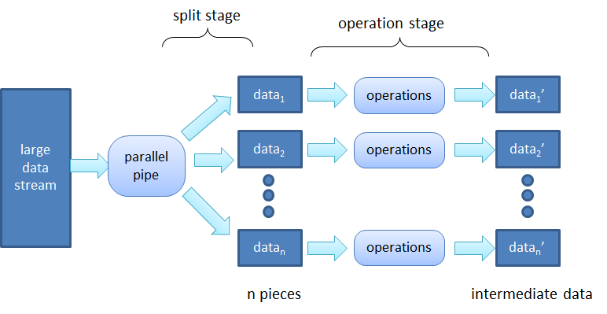

# Parallel Pipe (PAPI) 프로젝트 #
 
Papi프로젝트에서는 대용량의 텍스트 파일을 병렬적으로 처리하는 프로그램을 생성한다.
 
* 입력 데이터 형태   
입력되는 데이터는 텍스트 형태만을 가정한다. 그리고 텍스트 데이타는 \n으로 구분되는 여러 개의 라인으로 이루어져 있다. 한 줄은 1024 character이내이다.   
 
* 데이터 입력 방식   
데이터는 papi로 standard in을 통해서 들어온다. 따라서, papi는 전체 데이터의 크기를 알 수 없다. 계속 데이터가 입력이 될때 마다 처리를 해야하는 stream processing 방식으로 구현되어야 한다. 데이터를 모두 받아서 파일로 저장했다가 n등분하여 각 thread로 처리하는 방법은 틀린 구현방식이다.
 
* Papi 개념도   

   
* Papi 사용 형태   
Papi를 사용하는 방식은 다음의 예와 같다.   
$ cat largefile.txt | ./papi -c 4 "grep blackhole == sed 's/the//g' == wc -l"   
즉, shell의 pipe를 통하여 입력이 standard in으로 들어온다. Papi는 하나의 command line argument를 받는데 이것은 여러개의 명령들이 ==를 통해서 연결된 하나의 string이다. 이 명령어들은 하나의 데이터 파이프라인이 되는데 papi 메인이 n등분한 입력데이터들이 n개의 이러한 파이프라인을 각각 병렬적으로 통과하여 결과를 내게 된다. 위의 예제에서는 입력되는 텍스트 데이터에서 blackhole이란 단어를 가진 라인만을 추출하고 그 라인들 중에서 the를 없앤 후 라인 수를 세고 그 라인들의 수가 네줄로 찍히게 된다. 이러한 처리가 4개의 파이프라인에서 병렬적으로 처리된다.   
   
* Papi의 내부 구조   
Main함수에서는 thread를 생성한 후 standard in으로 들어오는 데이터를 라인별로 잘라서 각 thread에 전달한다.   
각 thread는 생성이 된 후, 필요한 개수의 pipe()를 호출하여 pipe descriptor들을 미리 준비한다. 이후 여러 fork를 수행하여 필요한 개수의 child process를 만들고 pipe의 input/output을 연결하여 (dup2사용, 불필요한 pipe descriptor 닫기) 데이터들이 잘 흘러 갈 수 있게 경로를 설정한다. 위의 예에서는 wc -l을 수행하는 process가 제일 마지막 process가 된다. 각 thread마다 이러한 데이터 파이프라인을 형성하게 되므로 위의 예에서는 전체 생성되는 child process의 개수는 3x4=12개가 된다.   
Main함수가 한 라인을 각 thread로 전달하기 위해서는 lock을 쓰기를 권장한다. Lock은 pthread_mutex_lock()함수를 사용하면 된다. Thread가 4개인 경우 4개의 lock을 생성하고, 1번의 thread에 데이터를 전달할때에는 1번 lock을 사용하고, 2번의 thread에 데이터를 전달할때에는 2번을 사용하는 등 각 thread별로 별도의 lock을 사용한다. 하나의 global lock을 사용해도 되기는 하지만 이럴 경우 한번 lock를 걸면 모든 thread들이 lock때문에 성능이 느려지므로 좋은 디자인이 아니다.   
# How To Compile?   
Linux(tested on Ubuntu 16.04.2)  : gcc ppipe.c my_thread_v3.c parse.c -o papi -lpthread     
   
# How To Execute?   
cat book2.txt | ./papi -c 4 "cat"   
cat book2.txt | ./papi -c 5 "grep paper == cat"   
cat book2.txt | ./papi -c 3 "grep a == sed 's/the//g' == wc -l"   
cat book2.txt | ./papi -c 2 "grep a == sed 's/the//g' == wc -l == cat"    
etc
